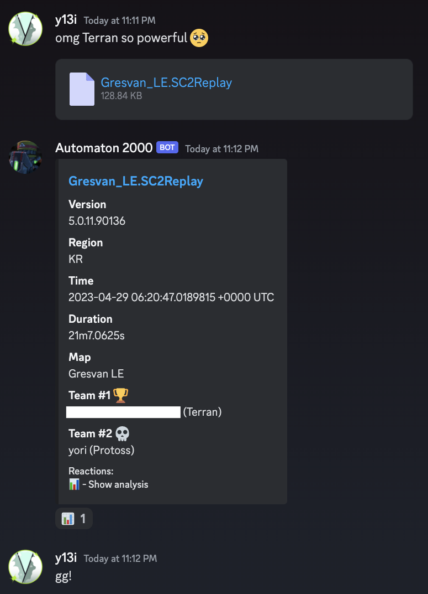

# sc2replay-discord

En taro Adun,

This is a Discord bot that responds with a summary of a StarCraft 2 replay file (`.SC2Replay`) posted in a text channel.

**[Invite to your Discord server!!](https://discord.com/api/oauth2/authorize?client_id=909174200068079716&permissions=2048&scope=bot)**



## Development

Set your discord bot token in the environment variable `DISCORD_TOKEN`. See `.envrc.example`. [direnv](https://direnv.net/) is recommended.

```bash
$ go run .
```
